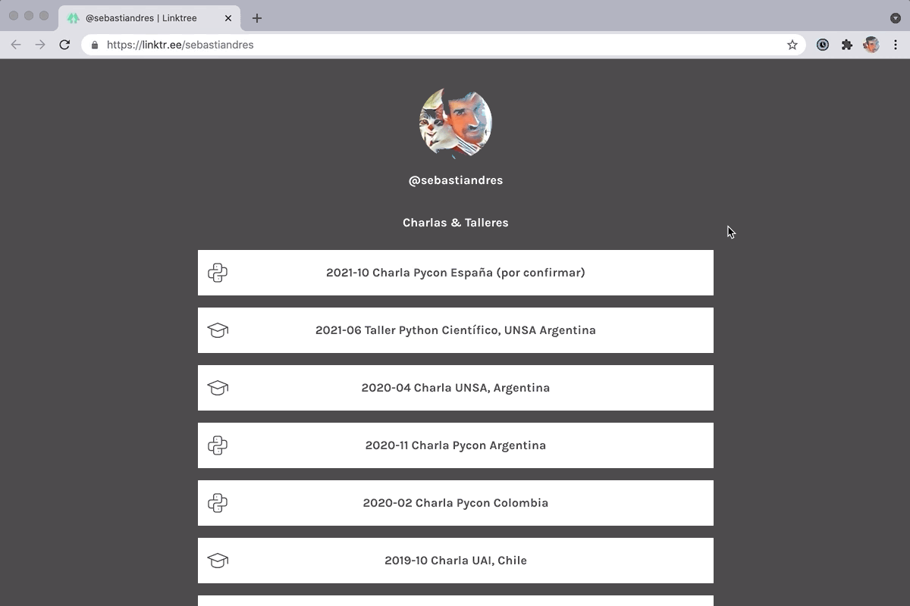

::: {.content-visible when-profile="esp"}
Un directorio de enlaces permite tener entregar un link único y memorable, que puedes actualizar posteriormente a haberlo compartido. Donde, por ejemplo, al dar una charla pudiera decir “el código y la presentación estarán en este link”, pero donde posteriormente sea posible agregarle la grabación de la charla o un resultados de una encuesta. Probé con Linktree, pero pronto lo llené con demasiados enlaces y se volvió confuso y difícil de navegar. Necesitaba una forma de agrupar de manera temática y con un grado flexible de niveles de profundad. En efecto, si a alguien no le interesa el tema “X” probablemente no le interesaría el video de “X”, el código de “X”, la presentación de “X” en html o pdf.

 versus lo que necesitaba y que tuve que crear (derecha).")

Formato ofrecido por linktree (izquieda) versus lo que necesitaba y que tuve que crear (derecha).
Necesitaba una manera de tener un directorio de enlaces con un nombre memorable, fácil de compartir y personalizar, pero permitiendo mantener distintos niveles de agrupación. Desafío adicional: Cuando se trata de recursos en línea, soy un tacaño extremo. Así que buscaba una solución que pudiera implementar sin costos mensuales recurrentes.

Como tacaño extremo llegué a pensar en hacer varias cuentas en linktree y vincularlas entre sí, pero no era una solución escalable (y tendría que acordarme de que correo y password usé para cada enlace). Así que entre una mezcla de vergüenza y flojera terminé desechando la idea. La solución me llegó de golpe. Github permite mostrar páginas html estáticas. ¡Podía hacer una página html simple que emulara a linktree y que podía guardar en cada repositorio en github! El enlace central seguiría siendo en linktree (lintr.ee/sebastiandres en mi caso) y los enlaces serían a los htmls plano de cada repositorio de github. Es una buena mezcla, porque linktree es bastante amigable y tiene algunas herramientas de administración como activar/desactivar enlaces. Comencé revisando el código de linktree, pero era excesivamente largo y confuso. Así que puse manos a la obra y me puse a construir una solución de manera incremental.

* **Primera versión**: Un único archivo html, simple y funcional. Imita los colores y botones sólo con html y css, sin javascript, incluyendo la animación del botón. Comienzo a desplegarlo en mis repositorios y enlazarlos desde linktree. Basta con activar cada repositorio como github pages para que github proporcione un enlace fijo y estable para index.html (o README.md). No es perfecto, pero funciona, ya se cumple el funcionamiento mínimo. Problemas detectados: el tipo y tamaño de fuente es similar pero no es correcto. El despliegue en un smartphone es muy distinto entre linktree y imitación (tacaña).

 y mobile (derecha). Un resultado sorprendentemente similar para la cantidad de código y esfuerzo.")

* **Segunda versión**: Después de googlear, aprendí a manejar css selectivo usando @media (orientation: landscape/portrait). Problemas detectados: Todavía se ve un poco diferente, sobre todo en los márgenes y tamaño del botón. Al ir actualizando en mis repositorios esta segunda versión, me doy cuenta que es difícil recordar y distinguir visualmente cuál es la versión actual. Sería interesante tener algún tipo de indicador visual al respecto.
Tercera versión: Ajustes a las propiedades del css para imitar mejor linktree (width, height, text wrapping, font sizes). Incluye un texto con la versión para distinguir la versión utilizada en cada repositorio y hacer más fácil la actualización. Problemas detectados: Los textos no están centrados adecuadamente. Lo peor es tener que ir copiando manualmente el nuevo estilo a cada repositorio en cada nueva actualización. Lo ideal es que el estilo se manejara centralmente y actualizara automáticamente a todos los repositorios que lo utilizaran.

* **Cuarta versión**: En lugar de tener el css directamente en el html, lo muevo a un archivo css. De esa manera, todos los archivos pueden llamar a ese archivo. Eso permite separar contenido de formato. Esta cuarta versión me dio muchos problemas. En local todo funcionaba bien, pero github no desplegaba bien la página por un problema con el MIME type del archivo css. Así que tuve que usar https://raw.githack.com para obtener un enlace del css con el MIME type correcto. Problemas detectados: La actualización de css con github a través de https://raw.githack.com tiene un lag importante, a veces de horas, por lo que es difícil (y frustrante) comprobar si el cambio resultó bien.

* **Quinta versión**: Comienzo a utilizar DigitalOcean para levantar un sitio estático a partir del repositorio en github. De esa manera, se generan urls fijas de los assets (css o eventualmente javascript) que se actualizan automáticamente con cada push a github, sin costo asociado y con el MIME type adecuado. Eso permite tener un enlace estable para css y html que puede utilizarse en los repos de github. Ahora también externalizo la “versión” del archivo, para que sea importado por el archivo. Estos archivos css y html ahora se llamarán siempre “latest_style.css” y “latest_copyright.html”, y que actualizo con cada cambio de versión. Así el archivo final se actualiza automáticamente cuando hay algún cambio (¡¡¡no más cambios masivos en los repos!!!). Se definen también algunas clases adicionales para manejar títulos y subtítulos. Problemas detectados: En general se observa bien, pero hay algunos glitchs de tamaño de fuente, textos centrados y detalles así.

*** Sexta (y última) versión**: Revisión general del código para optimizarlo y limpiarlo. Se eliminan algunas propiedades css innecesarias. Hay 3 archivos: El archivo principal es index.html donde se definen los enlaces, y se utilizan los archivos latest_style.css (estilo) y latest_copyright.html (versión de emulador). Cada nueva página con enlaces sólo necesita definir los enlaces, ¡el estilo y copyright ya está definido! Problemas detectados: Nada por ahora.

 y mobile (derecha). Las versiones son prácticamente indistinguibles.")

**Sneak peak:**

¿Cómo es el código? La primera versión mezcla el código y el estilo. Hace que actualizar múltiples archivos sea tedioso y propenso a errores (pero fue una versión rápida de desarrollar y autocontenida).

```html
<!DOCTYPE html>
<html>
    <head>
        <style>
            html {background-color:#3d3b3c; font-family: Karla, sans-serif;
                  font-size: 16px; font-weight: 700;}
            h3, h2, h1 { color:#ffffff; margin-bottom: 16px; text-align: center;}
            div {position: fixed; top: 25%; left: 50%;
                -webkit-transform: translate(-50%, -50%); transform: translate(-50%, -50%);}
            a {text-decoration: none!important;}
            p  {background-color:#ffffff; color:#3d3b3c; line-height: 56px; width: 676px;
                border: 2px solid rgb(255, 255, 255); margin-bottom: 16px; text-align: center;}
            p:hover {background-color:#3d3b3c; color:rgb(255, 255, 255);}
        </style>
    </head>

    <body>
        <div>
            <h1>Emulador de Linktree</h1>
            <h3>Enlaces</h3>
            <a href="https://linktree-ixkge.ondigitalocean.app/demo1.html" target="_blank">
                <p>Primera versión</p>
            </a>
            <a href="https://linktree-ixkge.ondigitalocean.app/demo6.html" target="_blank">
                <p>Última versión</p>
            </a>
            <h3>Enlaces</h3>
            <a href="https://linktr.ee/sebastiandres">
                <p>⇦ linktree</p>
            </a>
        </div>
    </body>
</html>
```


La última versión permite cambiar el estilo y copyright de manera centralizada, y preocuparse únicamente del contenido.

```html
<!DOCTYPE html>
<html>
    <head>
        <link href="https://fonts.googleapis.com/css2?family=Karla:wght@300;400;600;700&amp;display=swap" rel="stylesheet">
        <link href="https://linktree-ixkge.ondigitalocean.app/latest_style.css" rel="stylesheet">
    </head>
    <body>
        <div>
            <h1>Emulador de Linktree</h1>
            <h3>Enlaces</h3>
            <a href="https://linktree-ixkge.ondigitalocean.app/demo1.html" target="_blank">
                <p>Primera versión</p>
            </a>
            <a href="https://linktree-ixkge.ondigitalocean.app/demo6.html" target="_blank">
                <p>Última versión</p>
            </a>
            <h3>Enlaces</h3>
            <a href="https://linktr.ee/sebastiandres">
                <p>⇦ linktree</p>
            </a>
        </div>
        <!-- Version - dont change this code-->
        <object data="https://linktree-ixkge.ondigitalocean.app/latest_copyright.html" width=100%></object>
    </body>
</html>
```

¿Y cómo se ve todo al final?
Se ve así:




## Aprendizajes:

La separación de contenido y forma es esencial para poder ahorrar trabajo. Incluso para un proyecto pequeño como éste, ayuda enormemente a no duplicar trabajo y hacer más fácil las actualizaciones de N páginas.

La primera versión, que tenía el 80% de las funcionalidades me tomó el 20% del tiempo invertido. Pero el 80% del tiempo restante me enseñó muchas cosas que no sabía de html y css, mime types, y fue muy valioso.

Crear Github pages por cada repositorio es muy práctico, pero tiene ciertas limitaciones para que la gente no abuse al crear páginas estáticas y sea utilizado como un webserver gratis. Existen algunos sitios para entregar css y javascript con el MIME type correcto (https://raw.githack.com por ejemplo), pero no se actualizan automáticamente. DigitalOcean permite levantar sitios estáticos a costo cero y con actualización automática, y poder tener todo sincronizado.

Enlaces de interés:
* https://linktr.ee/sebastiandres: Mi directorio de enlaces, el sitio que quería imitar.
linktree-ixkge.ondigitalocean.app: Sitio web estático, sirve como demo de “cómo se vería” y para almacenar/enlazar el css y copyright.
* https://github.com/sebastiandres/linktree: Repositorio con las distintas versiones del código. Puedes tomar la última versión de html, css y copyright y personalizarlo a tu antojo.
* ¿Cosas por mejorar? ¡Muchas! ¡Sugerencias y comentarios bienvenidos!
:::

::: {.content-visible when-profile="eng"}
A link directory lets you hand out a single, memorable link that you can update after having shared it. Where, for example, when giving a talk I could say “the code and the presentation will be at this link,” but where it is later possible to add the recording of the talk or the results of a survey. I tried Linktree, but I soon filled it with too many links and it became confusing and hard to navigate. I needed a way to group thematically and with a flexible degree of depth levels. Indeed, if someone is not interested in topic “X” they probably would not be interested in the video of “X,” the code of “X,” the presentation of “X” in html or pdf.

 versus what I needed and had to create (right).")

Format offered by linktree (left) versus what I needed and had to create (right).
I needed a way to have a link directory with a memorable name, easy to share and customize, but allowing different levels of grouping to be kept. Additional challenge: When it comes to online resources, I am an extreme cheapskate. So I was looking for a solution that I could implement without recurring monthly costs.

As an extreme cheapskate I even thought about making several linktree accounts and linking them to each other, but it was not a scalable solution (and I would have to remember which email and password I used for each link). So, between a mix of embarrassment and laziness, I ended up discarding the idea. The solution hit me all at once. Github allows showing static html pages. I could make a simple html page that emulated linktree and that I could store in each repository on github! The central link would still be on linktree (lintr.ee/sebastiandres in my case) and the links would point to the plain htmls of each github repository. It is a good mix, because linktree is fairly friendly and has some administration tools such as enabling/disabling links. I started by reviewing linktree's code, but it was excessively long and confusing. So I got to work and started building a solution incrementally.

* **First version**: A single html file, simple and functional. It imitates the colors and buttons using only html and css, no javascript, including the button animation. I start deploying it to my repositories and linking them from linktree. It is enough to enable each repository as github pages for github to provide a fixed and stable link for index.html (or README.md). It is not perfect, but it works, the minimum functionality is met. Problems detected: the font type and size are similar but not correct. The display on a smartphone is very different between linktree and the (cheapskate) imitation.

 and mobile (right). A surprisingly similar result for the amount of code and effort.")

* **Second version**: After googling, I learned to handle selective css using @media (orientation: landscape/portrait). Problems detected: It still looks a bit different, especially in the margins and button size. As I update this second version in my repositories, I realize that it is hard to remember and visually distinguish which is the current version. It would be interesting to have some kind of visual indicator about it.
Third version: Adjustments to the css properties to better imitate linktree (width, height, text wrapping, font sizes). It includes a text with the version to distinguish the version used in each repository and make updating easier. Problems detected: The texts are not centered properly. The worst is having to manually copy the new style to each repository on every new update. Ideally the style would be managed centrally and automatically updated to all the repositories that used it.

* **Fourth version**: Instead of having the css directly in the html, I move it to a css file. That way, all the files can call that file. This allows separating content from format. This fourth version gave me many problems. Locally everything worked fine, but github did not display the page well because of a problem with the MIME type of the css file. So I had to use https://raw.githack.com to obtain a css link with the correct MIME type. Problems detected: Updating the css with github through https://raw.githack.com has a significant lag, sometimes of hours, so it is hard (and frustrating) to check whether the change came out right.

* **Fifth version**: I start using DigitalOcean to spin up a static site from the github repository. That way, fixed urls are generated for the assets (css or eventually javascript) that update automatically with each push to github, at no associated cost and with the proper MIME type. This allows having a stable link for css and html that can be used in the github repos. Now I also externalize the “version” of the file, so that it is imported by the file. These css and html files will now always be called “latest_style.css” and “latest_copyright.html,” which I update with each version change. This way the final file updates automatically when there is any change (no more mass changes in the repos!!!). Some additional classes are also defined to handle titles and subtitles. Problems detected: In general it looks good, but there are some glitches in font size, centered texts and details like that.

*** Sixth (and last) version**: General review of the code to optimize and clean it up. Some unnecessary css properties are removed. There are 3 files: The main file is index.html where the links are defined, and the files latest_style.css (style) and latest_copyright.html (emulator version) are used. Each new page with links only needs to define the links, the style and copyright are already defined! Problems detected: Nothing for now.

 and mobile (right). The versions are practically indistinguishable.")

**Sneak peak:**

What does the code look like? The first version mixes the code and the style. It makes updating multiple files tedious and error-prone (but it was a quick version to develop and self-contained).

```html
<!DOCTYPE html>
<html>
    <head>
        <style>
            html {background-color:#3d3b3c; font-family: Karla, sans-serif;
                  font-size: 16px; font-weight: 700;}
            h3, h2, h1 { color:#ffffff; margin-bottom: 16px; text-align: center;}
            div {position: fixed; top: 25%; left: 50%;
                -webkit-transform: translate(-50%, -50%); transform: translate(-50%, -50%);}
            a {text-decoration: none!important;}
            p  {background-color:#ffffff; color:#3d3b3c; line-height: 56px; width: 676px;
                border: 2px solid rgb(255, 255, 255); margin-bottom: 16px; text-align: center;}
            p:hover {background-color:#3d3b3c; color:rgb(255, 255, 255);}
        </style>
    </head>

    <body>
        <div>
            <h1>Emulador de Linktree</h1>
            <h3>Enlaces</h3>
            <a href="https://linktree-ixkge.ondigitalocean.app/demo1.html" target="_blank">
                <p>Primera versión</p>
            </a>
            <a href="https://linktree-ixkge.ondigitalocean.app/demo6.html" target="_blank">
                <p>Última versión</p>
            </a>
            <h3>Enlaces</h3>
            <a href="https://linktr.ee/sebastiandres">
                <p>⇦ linktree</p>
            </a>
        </div>
    </body>
</html>
```


The latest version allows changing the style and copyright centrally, and worrying only about the content.

```html
<!DOCTYPE html>
<html>
    <head>
        <link href="https://fonts.googleapis.com/css2?family=Karla:wght@300;400;600;700&amp;display=swap" rel="stylesheet">
        <link href="https://linktree-ixkge.ondigitalocean.app/latest_style.css" rel="stylesheet">
    </head>
    <body>
        <div>
            <h1>Emulador de Linktree</h1>
            <h3>Enlaces</h3>
            <a href="https://linktree-ixkge.ondigitalocean.app/demo1.html" target="_blank">
                <p>Primera versión</p>
            </a>
            <a href="https://linktree-ixkge.ondigitalocean.app/demo6.html" target="_blank">
                <p>Última versión</p>
            </a>
            <h3>Enlaces</h3>
            <a href="https://linktr.ee/sebastiandres">
                <p>⇦ linktree</p>
            </a>
        </div>
        <!-- Version - dont change this code-->
        <object data="https://linktree-ixkge.ondigitalocean.app/latest_copyright.html" width=100%></object>
    </body>
</html>
```

And how does it all look in the end?
It looks like this:


## Lessons learned:

Separating content and form is essential to save work. Even for a small project like this one, it helps enormously to avoid duplicating work and to make updates to N pages easier.

The first version, which had 80% of the functionality, took me 20% of the time invested. But the remaining 80% of the time taught me many things I did not know about html and css, mime types, and it was very valuable.

Creating Github pages for each repository is very practical, but it has certain limitations so that people do not abuse it by creating static pages and use it as a free webserver. There are some sites to serve css and javascript with the correct MIME type (https://raw.githack.com for example), but they do not update automatically. DigitalOcean allows spinning up static sites at zero cost and with automatic updates, and keeping everything synchronized.

Links of interest:
* https://linktr.ee/sebastiandres: My link directory, the site I wanted to imitate.
linktree-ixkge.ondigitalocean.app: Static website, serves as a demo of “how it would look” and to store/link the css and copyright.
* https://github.com/sebastiandres/linktree: Repository with the different versions of the code. You can take the latest version of html, css and copyright and customize it to your liking.
* Things to improve? Many! Suggestions and comments welcome!
:::
