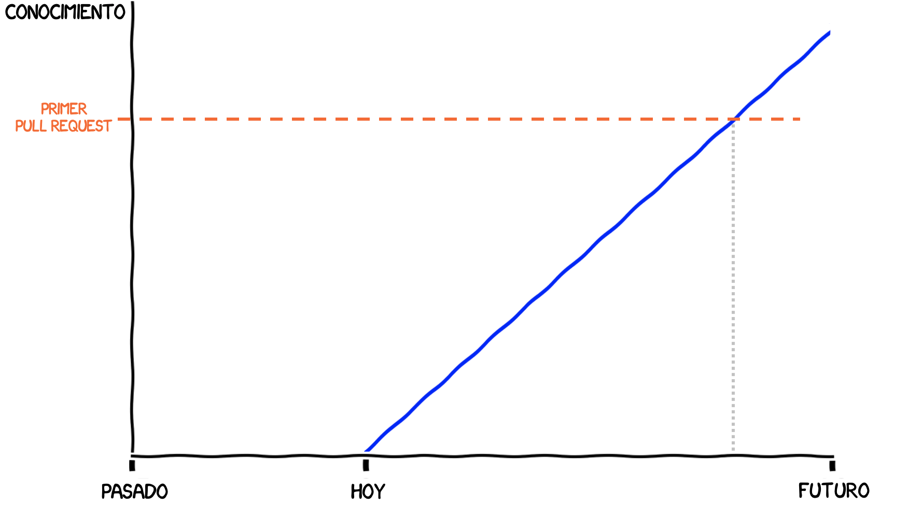
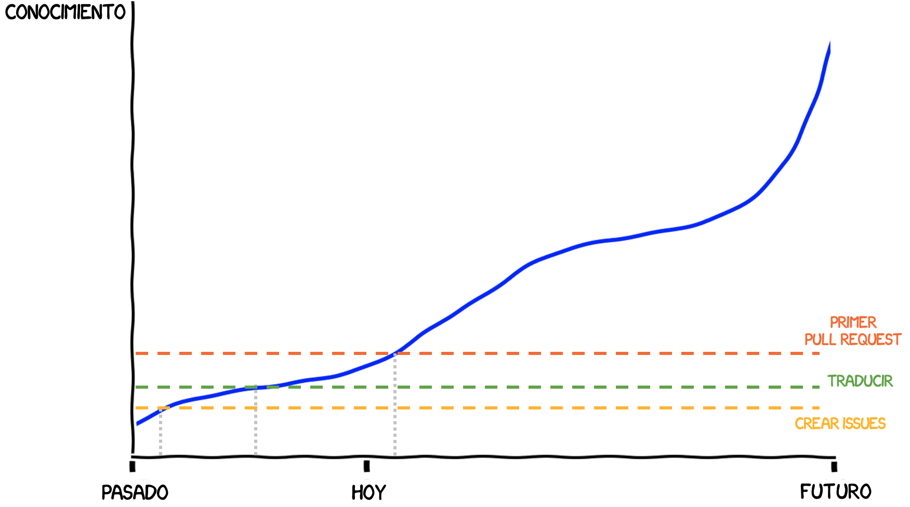

::: {.content-visible when-profile="esp"}
Desde hace mucho tiempo tenía el deseo de contribuir _“en algún momento”_ a un proyecto de código abierto. Sin embargo ese momento ideal siempre era pospuesto para más adelante, cuando tuviera más experiencia y más tiempo. Por eso, cuando leí sobre el Sprint de Data Umbrella en varios canales de Telegram de python y programación, no dudé y me inscribí. Era la oportunidad perfecta para obligarme a aprender. No hay nada como un poco de presión social para mover los engranajes de un procrastinador.

Para ser sincero, no ubicaba a [Data Umbrella](https://dataumbrella.org/). Se trata de una organización que se preocupa de proporcionar apoyo a grupos poco representado, ya sea por género, raza, edad, orientación sexual u otros, en los campos de Machine Learning, Data Science e Inteligencia Artificial. El sprint que realizaron el 26 de Junio tenía como foco Latinoamérica, que tiene una participación baja en estos temas. El trabajo de Data Umbrella con los grupos de poca representación resulta muy valioso para  derribar todos los mitos y barreras de entrada que pueden estar frenando la llegada de nuevos talentos.

Lo que más me gustó del Sprint de Data Umbrella fue la organización: tenían un checklist muy preciso de los temas a revisar, con videos explicando cada paso a paso. Por eso, era fácil estimar cuánto tiempo necesitabas preparando o aprendiendo antes del sprint. El uso de discord también ayudó mucho a darle una informalidad y aspecto comunitario, y sirvió para responder las preguntas y conocernos. Introducirse en nuevo grupo siempre es difícil, y para novatos el desafío es aún mayor. El hecho de tener un pre-sprint y post-sprint ayuda a consolidar el aspecto humano y comunitario, resolver los problemas técnicos que siempre aparecen, y ganar confianza.

Durante el sprint, el hecho de organizarnos para programar de a pares también fue de gran ayuda. Con Leonardo Rocco trabajamos en 2 issues:
* [DOC Ensures that ARDRegression passes numpydoc validation #20381](https://github.com/scikit-learn/scikit-learn/pull/20381)
* [DOC ensures FastICA estimator pass the numpydoc validation #20405](https://github.com/scikit-learn/scikit-learn/pull/20405)

¡Puedo decir con orgullo que ambos pull requests ya fueron aceptados!

Al reflexionar sobre mi experiencia en el Sprint, me doy cuenta que tenía la expectativa que me faltaban muchas cosas por aprender.

En el sprint aprendí que no se requiere ser un super-programador para contribuir al código abierto.
La realidad es que, de partida, no existe una única manera de contribuir. Hay un abanico interminable de posibles trabajos, desde los más sencillos a los más avanzados, y un largo camino de aprendizaje. Por eso, es importante darse cuenta que no se trata de que _“no sabes”_ sino que _“no sabes **aún**”_, y que hay una comunidad dispuesta a apoyarte en ese proceso de aprendizaje.
Todos estamos en un proceso de aprendizaje. Involucrarse en proyectos colaborativos es precisamente una manera de acelerar el aprendizaje, y de paso, contribuir a las librerías que más usas.

Hay un excelente informe del sprint en el [blog de Reshama](https://reshamas.github.io/data-umbrella-latam-2021-scikit-learn-sprint-report/). La distribución de los participantes por países es bastante sorprendente. Imaginaba una distribución más uniforme, pero la mayoria de los participantes son de Argentina y Brasil. ¡Hay hacer algo al respecto!

Además de las contribuciones comunitarias e individuales, otro elemento importante del código abierto son las subvenciones y la financiación por parte de empresas. ¡Pídele a tu jefe presupuesto para financiar las herramientas que usas a diario! En particular, este sprint fue financiado en parte por una subvención de [Code for Science & Society](https://eventfund.codeforscience.org/). Esto es comunidad y transparencia en estado puro: puedes obtener todos los detalles de la subvención en línea: [Grant number GBMF8449](https://www.moore.org/grant-detail?grantId=GBMF8449) en [Gordon and Betty Moore Foundation](https://www.moore.org/).
:::

::: {.content-visible when-profile="eng"}
For a long time I had the desire to contribute _“at some point”_ to an open source project. However, that ideal moment was always postponed for later, when I had more experience and more time. That is why, when I read about the Data Umbrella Sprint in several python and programming Telegram channels, I did not hesitate and signed up. It was the perfect opportunity to force myself to learn. There is nothing like a bit of social pressure to get a procrastinator's gears moving.

To be honest, I was not familiar with [Data Umbrella](https://dataumbrella.org/). It is an organization that cares about providing support to underrepresented groups, whether by gender, race, age, sexual orientation or others, in the fields of Machine Learning, Data Science and Artificial Intelligence. The sprint they held on June 26 had Latin America as its focus, which has low participation in these topics. Data Umbrella's work with underrepresented groups is very valuable for tearing down all the myths and entry barriers that may be holding back the arrival of new talent.

What I liked most about the Data Umbrella Sprint was the organization: they had a very precise checklist of the topics to review, with videos explaining each step. That is why it was easy to estimate how much time you needed preparing or learning before the sprint. The use of discord also helped a lot to give it an informal and community feel, and served to answer questions and get to know each other. Joining a new group is always hard, and for newcomers the challenge is even greater. Having a pre-sprint and post-sprint helps consolidate the human and community aspect, solve the technical problems that always appear, and gain confidence.

During the sprint, organizing ourselves to do pair programming was also a great help. With Leonardo Rocco we worked on 2 issues:
* [DOC Ensures that ARDRegression passes numpydoc validation #20381](https://github.com/scikit-learn/scikit-learn/pull/20381)
* [DOC ensures FastICA estimator pass the numpydoc validation #20405](https://github.com/scikit-learn/scikit-learn/pull/20405)

I can proudly say that both pull requests have already been accepted!

Reflecting on my experience at the Sprint, I realize that I had the expectation that I was missing many things to learn.

At the sprint I learned that you do not need to be a super-programmer to contribute to open source.
The reality is that, to begin with, there is no single way to contribute. There is an endless range of possible tasks, from the simplest to the most advanced, and a long learning path. That is why it is important to realize that it is not that you _“don't know”_ but that you _“don't know **yet**”_, and that there is a community willing to support you in that learning process.
We are all in a learning process. Getting involved in collaborative projects is precisely a way to accelerate learning, and, along the way, contribute to the libraries you use the most.

There is an excellent report of the sprint on [Reshama's blog](https://reshamas.github.io/data-umbrella-latam-2021-scikit-learn-sprint-report/). The distribution of participants by country is quite surprising. I imagined a more uniform distribution, but most of the participants are from Argentina and Brazil. Something has to be done about it!

In addition to community and individual contributions, another important element of open source is grants and funding from companies. Ask your boss for budget to fund the tools you use daily! In particular, this sprint was funded in part by a grant from [Code for Science & Society](https://eventfund.codeforscience.org/). This is community and transparency in their purest form: you can get all the details of the grant online: [Grant number GBMF8449](https://www.moore.org/grant-detail?grantId=GBMF8449) at the [Gordon and Betty Moore Foundation](https://www.moore.org/).
:::
