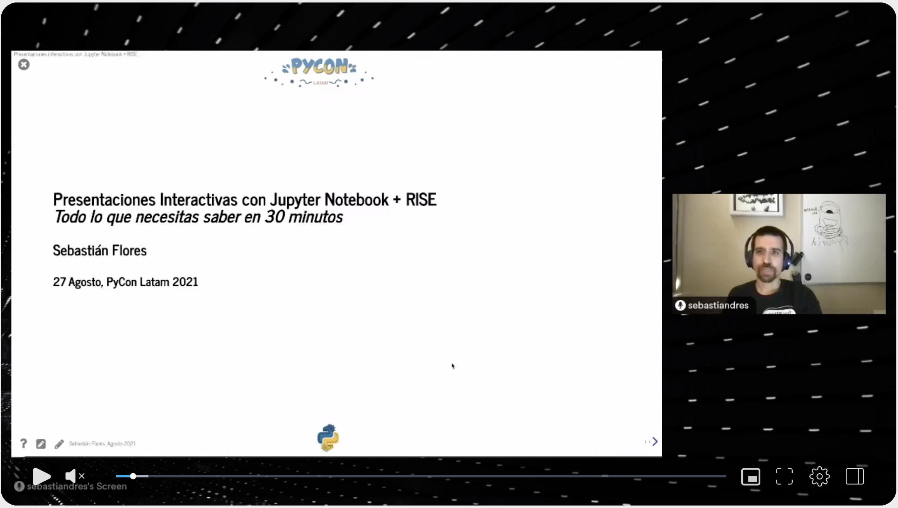
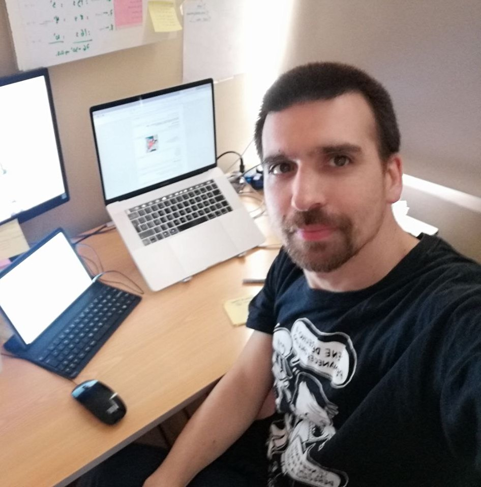

::: {.content-visible when-profile="esp"}
Acabo de terminar mi charla en la PyCon Latam 2021, y fue una gran experiencia.
A diferencia de otras oportunidades, estaba relajado y disfruté muchísimo dar la charla.
Creo que la diferencia tuvo que ver con la preparación. Aunque ya sabía bastante,
había aprendido muchísimo más en las últimas semanas preparando el tutorial de RISE que publiqué en el blog.
Así que ya tenía todo el material a mano, y fue fácil armar las diapositivas.

En la PyCon utilizamos la plataforma hubilo.com que me gustó mucho, fue fácil de utilizar y no tuve
complicaciones durante el evento. Un tremendo esfuerzo del equipo organizador, porque tuvieron que cambiarse
a última hora de la plataforma que tenían considerada últimamente.

Algunas de las cosas que aprendí específicamente para esta presentación fueron:
* Porqué se llama RISE: Reveal.js IPython Slideshow Extension
* Utilizar `_repr_html_` para tener una representación nativa para los jupyter notebook,
* A ocultar los botones con `,`, y a usar header y footer con propiedades de html.
* A hacer animaciones más complejas con `
Mi texto
`, al igual que en [revealjs](https://revealjs.com/)
* A ocultar código con un botón.

La presentación en sus distintas formas de visualización se encuentran acá: [Slides pylatam](https://sebastiandres.github.io/talk_2021_08_pylatam/)
:::

::: {.content-visible when-profile="eng"}
I just finished my talk at PyCon Latam 2021, and it was a great experience.
Unlike on other occasions, I was relaxed and really enjoyed giving the talk.
I think the difference had to do with preparation. Although I already knew quite a bit,
I had learned much more in the last few weeks preparing the RISE tutorial that I published on the blog.
So I already had all the material at hand, and it was easy to put the slides together.

At PyCon we used the platform hubilo.com, which I liked a lot; it was easy to use and I had no
complications during the event. A tremendous effort by the organizing team, because they had to switch
at the last minute from the platform they had been considering lately.

Some of the things I learned specifically for this presentation were:
* Why it is called RISE: Reveal.js IPython Slideshow Extension
* To use `_repr_html_` to have a native representation for jupyter notebooks,
* To hide the buttons with `,`, and to use header and footer with html properties.
* To make more complex animations with `
Mi texto
`, just like in [revealjs](https://revealjs.com/)
* To hide code with a button.

The presentation in its different display formats can be found here: [Slides pylatam](https://sebastiandres.github.io/talk_2021_08_pylatam/)
:::
