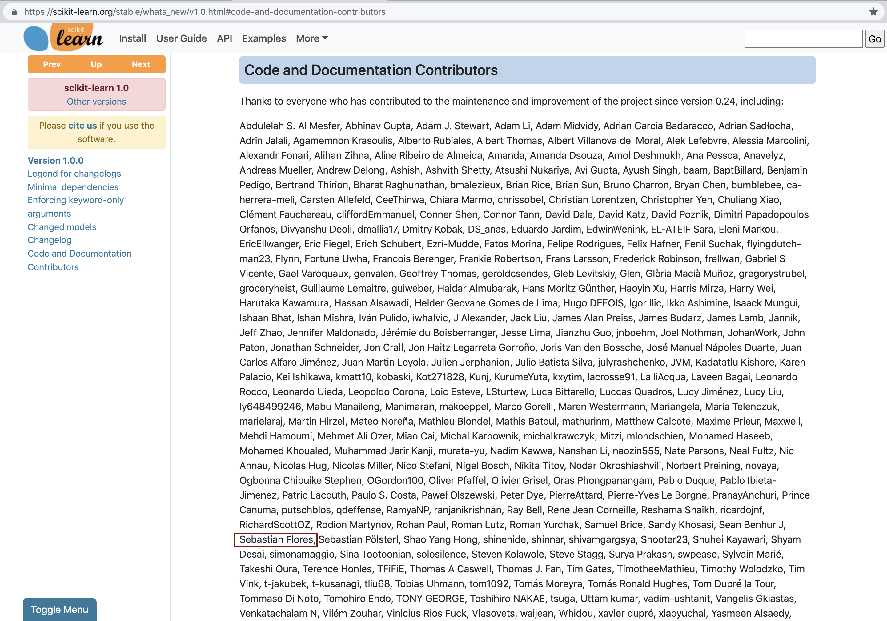

::: {.content-visible when-profile="esp"}
Con tanto orgullo como pudor, me he enterado que mi nombre ha aparecido en la lista de contribuciones de [scikit learn (sklearn)](
https://scikit-learn.org/stable/whats_new/v1.0.html#code-and-documentation-contributors):

Al respecto, mi reflexión es que nunca es tarde para aprender. Llevaba mucho tiempo trabajando en [proyectos individuales](https://sebastiandres.github.io/blog/proyectos/), donde las contribuciones son más simples: puedes hacer commit directo al main, sabes donde está cada parte del proyecto y pones el ritmo. Pero sentía que no haber contribuido a un proyecto open source era una gran deuda, por usar constantemente múltipes librerías open source y no retribuir justamente todo lo que nos entregan. El [sprint de Data Umbrella](https://sebastiandres.github.io/blog/sprint-data-umbrella/) fue un buen impulso para aprender de manera guiada y fácil, y con mi compañero de sprint hicimos 2 pull requests para corregir documentación de la librería. Me siento muy privilegiado de que mi nombre esté ahí, justo en ese importante cambio de la versión 0.24 a la 1.0, justo y de chiripazo en uno de los milestones de sklearn.

Un último pensamiento: corregir documentación, aunque sean cosas superficiales y de forma, toma tiempo. Quizás no es una contribución revolucionaria, pero alguien tiene que hacerlo y es una excelente manera de contribuir, perder la timidez y aprender. Hacer constibuciones de código debe ser aún más intenso, pero por lo mismo, también más satisfactorio. Ya llegaremos a eso, espero durante el 2021.
:::

::: {.content-visible when-profile="eng"}
With as much pride as bashfulness, I found out that my name appeared in the contributions list of [scikit learn (sklearn)](
https://scikit-learn.org/stable/whats_new/v1.0.html#code-and-documentation-contributors):

In this regard, my reflection is that it is never too late to learn. I had been working for a long time on [individual projects](https://sebastiandres.github.io/blog/proyectos/), where contributions are simpler: you can commit directly to main, you know where each part of the project is and you set the pace. But I felt that not having contributed to an open source project was a great debt, for constantly using multiple open source libraries and not duly giving back for everything they give us. The [Data Umbrella sprint](https://sebastiandres.github.io/blog/sprint-data-umbrella/) was a good push to learn in a guided and easy way, and with my sprint partner we made 2 pull requests to fix the library's documentation. I feel very privileged that my name is there, right at that important change from version 0.24 to 1.0, just by luck in one of sklearn's milestones.

One last thought: fixing documentation, even if they are superficial and cosmetic things, takes time. Maybe it is not a revolutionary contribution, but someone has to do it and it is an excellent way to contribute, lose your shyness and learn. Making code contributions must be even more intense, but for that same reason, also more satisfying. We will get to that, I hope during 2021.
:::
