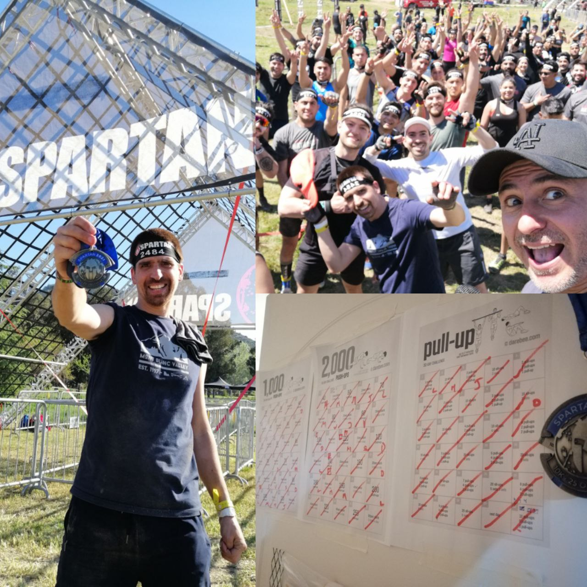

::: {.content-visible when-profile="esp"}
El fin de semana del 23 de Octubre con mi hijo participamos en una Spartan Race, que son carreras donde además de correr hay que ir superando distintos tipos de obstáculos. Igna participó en la versión de 2 vueltas de 1.6 km y 10 obstáculos, y yo en la versión de 10 km y 25 obstáculos. Fue una experiencia intensa y única, y terminé aprendiendo y reflexionando sobre cosas difíciles de anticipar.

Primero que nada: **la preparación**.
Me había inscrito en la carrera 4 meses antes, y de a poco me preparé desarrollando fuerza de brazos y resistencia. Es increíble lo 10 ó 20 minutos diarios puede hacer en tu estado físico. Pequeños cambios en tu rutina, sostenidos en el tiempo, pueden traer grandes resultados. Además, creo que es una buena filosofía inscribirse en una meta sin estar preparado, porque ponerle fecha te obliga a cambiar tu rutina y hacer cosas para concretarla. De seguro no habría hecho nada de ejercicio si no me hubiera inscrito en la Spartan Race. Y si hubiera sabido lo difícil y desafiante que sería, no me hubiera inscrito. Pero lo hice, y me di cuenta que tenía mucha más resistencia física y mental de lo que pensaba. Personalmente, me cuesta mantener rutinas en el tiempo sin tener un objetivo o meta clara, así que necesito ir renovando las metas en el tiempo.

Segundo que todo: **en equipo siempre es mejor**.
Tuve la fortuna de ser acompañado en la carrera por Julio, un amigo del trabajo. Estoy seguro que no habría podido terminar la carrera sin la compañía y el aliento de Julio. Me sorprendió que teníamos distintas fortalezas y debilidades, y que a cada uno le costaba más o menos distintas pruebas, por lo que nos complementábamos bien en darnos consejo y apoyarnos. Una lección que reaprendemos constantemente: las diferencias nos hacen más fuertes como equipo.

Otro aspecto: **bendita ignorancia**.
Al inicio, cuando corrimos por un terreno con barro y agua, pensé en lo incómodo que sería el resto de la carrera con las zapatillas mojadas. No sabía que minutos más adelante tendría que sumergirme completamente en una fosa con agua para pasar por debajo de un obstáculo. Esa fue la tónica del evento: cada obstáculo era más dificil o exigente que el anterior, en una progresión que no parecía tener fin. De haber sabido todo lo que tendría que realizar, no sé si me hubiera inscrito en la carrera o si hubiera podido terminarla; hubiera sido demasiado abrumador. Enfrentar obstáculo a obstáculo, paso a paso, es una estrategia que te permite conquistar cualquier desafío.

Por último: **fortaleza mental sobre física**
Me gustó ver que en la carrera habían todo tipo de cuerpos: más o menos tonificados, más delgados y más gruesos, hombres y mujeres, todos unidos por un deseo de superación. La carrera se corría más en la cabeza que en los pies: Los obstáculos estaban diseñados para probar tanto tu fortaleza física como mental. Y creo que más allá de la medalla, me llevo aprenizajes sobre mi percepción de mi mismo, de mis límites auto-impuestos, y de como superarlos.

:::

::: {.content-visible when-profile="eng"}
On the weekend of October 23rd my son and I took part in a Spartan Race, which are races where, besides running, you have to overcome different types of obstacles. Igna took part in the 2-lap version of 1.6 km and 10 obstacles, and I did the version of 10 km and 25 obstacles. It was an intense and unique experience, and I ended up learning and reflecting on things that are hard to anticipate.

First of all: **preparation**.
I had signed up for the race 4 months earlier, and little by little I prepared by developing arm strength and endurance. It's incredible what 10 or 20 minutes a day can do for your physical condition. Small changes in your routine, sustained over time, can bring great results. Also, I think it's a good philosophy to sign up for a goal without being prepared, because putting a date on it forces you to change your routine and do things to make it happen. I surely wouldn't have done any exercise if I hadn't signed up for the Spartan Race. And if I had known how hard and challenging it would be, I wouldn't have signed up. But I did, and I realized that I had much more physical and mental endurance than I thought. Personally, I find it hard to keep routines over time without having a clear objective or goal, so I need to keep renewing my goals over time.

Second of all: **a team is always better**.
I was fortunate to be accompanied in the race by Julio, a friend from work. I'm sure I wouldn't have been able to finish the race without Julio's company and encouragement. I was surprised that we had different strengths and weaknesses, and that each of us found different challenges more or less difficult, so we complemented each other well in giving advice and supporting one another. A lesson we constantly relearn: differences make us stronger as a team.

Another aspect: **blessed ignorance**.
At the start, when we ran across a stretch of mud and water, I thought about how uncomfortable the rest of the race would be with wet shoes. I didn't know that minutes later I would have to fully submerge myself in a water pit to pass under an obstacle. That was the theme of the event: each obstacle was harder or more demanding than the previous one, in a progression that seemed to have no end. Had I known everything I would have to do, I don't know if I would have signed up for the race or if I could have finished it; it would have been too overwhelming. Facing obstacle after obstacle, step by step, is a strategy that lets you conquer any challenge.

Finally: **mental strength over physical**
I liked seeing that in the race there were all kinds of bodies: more or less toned, thinner and bulkier, men and women, all united by a desire to better themselves. The race was run more in the head than in the feet: the obstacles were designed to test both your physical and mental strength. And I think that beyond the medal, I take away lessons about my perception of myself, of my self-imposed limits, and of how to overcome them.

:::
