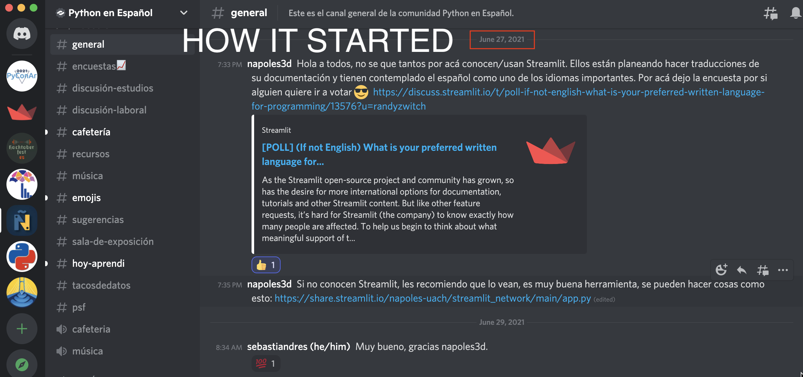

::: {.content-visible when-profile="esp"}
Terminó la PyCon Chile 2021, y fue una tremenda experiencia. El evento estuvo impecablemente organizado, con gran nivel técnico para la transmisión de las charlas y de los ponentes. Realmente, un lujo tener un evento de esta calidad, gratis y abierto a todo quien quiera aprender.

El viernes 5 de Noviembre participé en el taller de streamlit que organizaba José Manuel Nápoles - [@napoles3D](https://twitter.com/napoles3D). Inicialmente iba a dictar una la sección B del taller, porque se habían inscrito +70 personas en el taller y una única sección no era suficiente, pero finalmente no llegaron todos los inscritos y me dediqué a hacer apoyo técnico y moderar el chat. El taller fue dictado directamente en discord, que para una cantidad baja de asistentes funciona bastante bien. El material creado por JM está muy bueno, y aprovecho de compartirlo. Lamentablemente, el taller no fue grabado :(

* Apuntes del taller: [notion](https://www.notion.so/Pycon-Chile-Streamlit-Tutorial-2-hrs-cc17e56b22844a3a92638c44db06da47)
* Código: [github](https://github.com/napoles-uach/Pycon_cl_taller)

El domingo 7 dicté mi charla sobre streamlit. La charla tenía una duración de 25 mins, y la presentación en sí misma es una app de streamlit. Eso me permitió mostrar las funcionalidades de streamlit de manera nativa. Me sentí un poco traidor de no usar RISE, pero era más natural (y un buen desafío de programación) el construir la presentación directamente en python con streamlit.

* Video: [youtube](https://www.youtube.com/watch?v=qSn8in4QJYI&t=10907s)
* App online en streamlit: [webapp](https://share.streamlit.io/sebastiandres/talk_2021_11_pyconcl/main)
* Código: [github](https://github.com/sebastiandres/talk_2021_11_pyconcl)

La presentación tuvo una muy buena recepción, lo que me deja muy contento por haber generado contenido en español para la comunidad. Invertí muchas horas creando y aprendiendo, y creo que definitivamente fue tiepo bien invertido. La charla-app fue incluso destacada en [twitter](https://twitter.com/DataChaz/status/1457658699305082881) y por el equipo de streamlit en su [weekly roundup](https://discuss.streamlit.io/t/weekly-roundup-streamlit-as-a-powerpoint-google-trends-excel-file-updates-and-more/19045).

Y todo comenzó el 27 de Junio, con un comentario de JM en el discord de Python en Españo.

:::

::: {.content-visible when-profile="eng"}
PyCon Chile 2021 has ended, and it was a tremendous experience. The event was impeccably organized, with a great technical level for the broadcasting of the talks and the speakers. Truly, a luxury to have an event of this quality, free and open to everyone who wants to learn.

On Friday November 5th I took part in the streamlit workshop organized by José Manuel Nápoles - [@napoles3D](https://twitter.com/napoles3D). Initially I was going to teach section B of the workshop, because +70 people had signed up for the workshop and a single section wasn't enough, but in the end not all the registrants showed up and I devoted myself to providing technical support and moderating the chat. The workshop was delivered directly on discord, which works quite well for a small number of attendees. The material created by JM is very good, and I take the chance to share it. Unfortunately, the workshop was not recorded :(

* Workshop notes: [notion](https://www.notion.so/Pycon-Chile-Streamlit-Tutorial-2-hrs-cc17e56b22844a3a92638c44db06da47)
* Code: [github](https://github.com/napoles-uach/Pycon_cl_taller)

On Sunday the 7th I gave my talk about streamlit. The talk lasted 25 mins, and the presentation itself is a streamlit app. That allowed me to showcase streamlit's features natively. I felt a bit like a traitor for not using RISE, but it was more natural (and a good programming challenge) to build the presentation directly in python with streamlit.

* Video: [youtube](https://www.youtube.com/watch?v=qSn8in4QJYI&t=10907s)
* Online app on streamlit: [webapp](https://share.streamlit.io/sebastiandres/talk_2021_11_pyconcl/main)
* Code: [github](https://github.com/sebastiandres/talk_2021_11_pyconcl)

The presentation was very well received, which makes me very happy for having generated content in Spanish for the community. I invested many hours creating and learning, and I think it was definitely time well spent. The talk-app was even featured on [twitter](https://twitter.com/DataChaz/status/1457658699305082881) and by the streamlit team in their [weekly roundup](https://discuss.streamlit.io/t/weekly-roundup-streamlit-as-a-powerpoint-google-trends-excel-file-updates-and-more/19045).

And it all started on June 27th, with a comment from JM on the Python en Español discord.

:::
