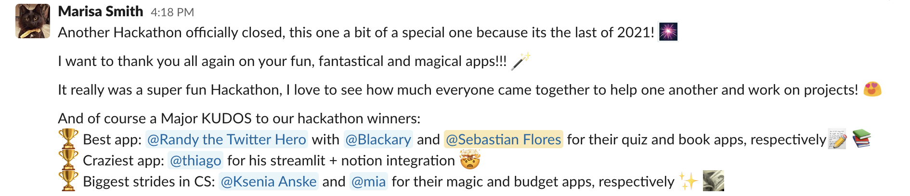

::: {.content-visible when-profile="esp"}
Hace unas semanas, el equipo detrás de streamlit me invitó a participar a una hackathon con temática de educación. Todo se lo debo a la visibilidad que logró la presentación que hice en la PyCon Chile, donde las diapositivas mismas de la presentación estaban hechas en streamlit, y fue destacado por streamlit en twitter. Me siento muy halagado de que me hayan invitado a participar.

La participación se ha desarrollado más que nada en un canal dedicado en el slack del equipo de streamlit, y en una página de notion donde están las explicaciones y los equipos. Notion funciona increíblemente bien para textos colaborativos, y el hecho de poder crear templates automáticos y enlazados es maravilloso.

El viernes 19 de noviembre fue la presentación de proyectos de la hackathon. Los proyectos tenían un gran nivel, me sorprendieron mucho. Una app que se mostraba en streamlit todo lo que se escribía en un archivo de notion, otra que generaba una app de streamlit a partir de una descripción usando codex, y otros que analizaban datos de la bolsa o criptomonedas.

Mi proyecto consistió en crear una librería, que llamé streamlit-book, que permite navegar archivos python+streamlit y markdown, además de definir un formato para realizar quizzes y actividades (en markdown y python) usando los elementos de streamlit. Mi objetivo era crear una forma de usar streamlit para crear y distribuir contenido de un curso.

¡Puedo comentar con orgullo que compartió el primer lugar de la hackathon!

Desde entonces, he estado trabajando en empaquetar todo y dejarlo completamente funcional:
* La librería ya está disponible en pypi y es instalable por pip.
* La librería tiene documentación en [readthedocs](https://streamlit-book.readthedocs.io).
* Estoy escribiendo un mini-tutorial (en inglés) para que streamlit pueda usarlo y difundir así mi trabajo. Lo hice pensando en explicar algo sencillo, con gráficos y que fuera divertido: Happy birds.

Algunos aprendizajes de la hackathon:
* Me entretuve mucho escribiendo código. Es algo que debo hacer con mayor frecuencia. Programar con GitHub's Copilot además me hizo muy productivo, por momentos entendía perfectamente la intención y completaba muy bien el código. Hay un potencial increíble ahí. Seguro que el paso de asembly a C, y de C/C++ a python debe haber sido un salto conceptual similar (aunque menor).
* Trabajar solo hace que no cuestiones tus decisiones. Acordar un formato, discutiendo pros y contras, me hubiera ayudado a no tener tantas dudas y cambios durante el proyecto.

El destino de la librería quizás sea similar al resto de mis +70 repositorios en github, con poco tráfico y más centrados en mi aprendizaje personal... pero nunca se sabe, ¡ojalá alguien la pueda aprovechar!
:::

::: {.content-visible when-profile="eng"}
A few weeks ago, the team behind streamlit invited me to take part in a hackathon with an education theme. I owe it all to the visibility achieved by the presentation I gave at PyCon Chile, where the presentation slides themselves were made in streamlit, and it was featured by streamlit on twitter. I feel very flattered that they invited me to participate.

The participation has taken place mostly in a dedicated channel on the streamlit team's slack, and in a notion page where the explanations and teams are. Notion works incredibly well for collaborative texts, and being able to create automatic and linked templates is wonderful.

Friday November 19th was the project presentation for the hackathon. The projects had a great level; they surprised me a lot. An app that showed in streamlit everything written in a notion file, another that generated a streamlit app from a description using codex, and others that analyzed stock market or cryptocurrency data.

My project consisted of creating a library, which I called streamlit-book, that lets you navigate python+streamlit and markdown files, as well as defining a format for creating quizzes and activities (in markdown and python) using streamlit elements. My goal was to create a way to use streamlit to create and distribute course content.

I can proudly mention that it shared first place in the hackathon!

Since then, I've been working on packaging everything and making it fully functional:
* The library is now available on pypi and installable via pip.
* The library has documentation on [readthedocs](https://streamlit-book.readthedocs.io).
* I'm writing a mini-tutorial (in English) so that streamlit can use it and thus spread my work. I made it thinking about explaining something simple, with charts, and that would be fun: Happy birds.

Some lessons from the hackathon:
* I had a lot of fun writing code. It's something I should do more often. Programming with GitHub's Copilot also made me very productive; at times it perfectly understood the intent and completed the code very well. There's incredible potential there. Surely the step from assembly to C, and from C/C++ to python must have been a similar (though smaller) conceptual leap.
* Working alone means you don't question your decisions. Agreeing on a format, discussing pros and cons, would have helped me not have so many doubts and changes during the project.

The fate of the library may be similar to the rest of my +70 repositories on github, with little traffic and more focused on my personal learning... but you never know, hopefully someone can make good use of it!
:::
