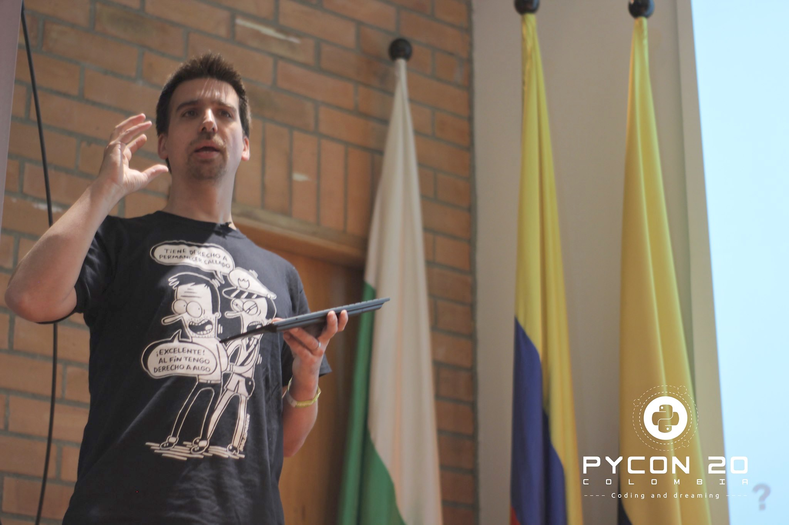

::: {.content-visible when-profile="esp"}
Hace casi 2 años, en la última semana del año 2019, me puse a pensar en las cosas de las que me arrepentiría de no haber hecho. Una sobresalía por ser una gran deuda pendiente: nunca había participado en una PyCon. Había visto algunas charlas en línea de temas que quería aprender pero tenía la impresión que eran sólo para los desarrolladores expertos. ¡Cuán equivocado estaba! Era el síndrome del impostor en toda su gloria: para ese entonces, ya llevaba unos 10 años desarrollando en Python, había creado algunos softwares, bibliotecas de computación científica con numpy, y me encantaba el lenguaje. Sin embargo, no me consideraba un verdadero desarrollador: nunca había colaborado en un proyecto Open Source y no formaba parte de ninguna comunidad. Aún así, la curiosidad y ganas eran más grandes, y en un momento de impulsividad me inscribí en la PyCon Colombia. Ya después arreglaría el tema de los pasajes y estadía.

Algunos días más tarde, averigüé más sobre el evento. Todavía estaba abierta la llamada a charlas, y me atreví a postular. Total, era difícil que aceptaran mi charla, y al menos podría decirme a mí mismo que lo había intentado. El tema que propuse era un problema muy específico: cómo hacer encuestas interactivas en una presentación con Jupyter Notebooks y la extensión rise. Un tema para el cual no había encontrado información en internet. Era la charla que me hubiera encantado escuchar y que nunca había encontrado. Para mi sorpresa, la postulación fue aceptada y ya no tenía excusas para no ir. ¡Medellín, allá vamos! Eran todavía los tiempos de las conferencias presenciales.

Me es difícil describir cuán importante y transformadora fue esa PyCon. Primero que nada, me ayudó a entender que la comunidad de Python es tremendamente receptiva, inclusiva y diversa: hay espacios para todos los interesados, desde quienes comienzan a quienes definen el lenguaje, y que las aplicaciones de Python recorren todas las industrias y temáticas. Fue fascinante compartir mi geekismo con otras personas y encontrar pares en las charlas, además de ir a keynotes de los cuales aprendí muchísimo, y tener la posibilidad de hablar con grandes referentes personales como Fernando Pérez (Ipython y Jupyter) y Wes McKinney (pandas).

Lo que más me sorprendió fue que toda la gente era completamente normal: nadie se las daba de estrella, y podías entablar conversación con cualquiera. Lo disfruté tanto que me arrepentí de haberme perdido las conferencias anteriores. ¡Cuánto tiempo había perdido por no haberme atrevido antes!

Desde entonces he participado en más eventos y siempre ha sido una experiencia transformadora: desde descubrir nuevas bibliotecas, aprender algún nuevo truquillo de Python, compartir mis intereses, expandir redes de contacto y un largo etcétera.

He dado algunas charlas adicionales, en PyCons de Chile, Argentina y Latam. También he sido rechazado en muchas otras, como en la Jupyter Con. ¿Y saben qué? No pasa nada. La vida sigue, de los rechazos he aprendido que mi propuesta no estaba suficientemente madura como para ser presentada. Y punto. No hay que darle más vueltas. Como todo, creo que mis charlas mejoraron con el tiempo gracias a la retroalimentación y el aprendizaje. Mi última charla en la PyCon Chile, sobre la biblioteca streamlit con la que estaba comenzando a jugar, llamó la atención de la comunidad y ahora me encuentro colaborando con los creadores y su comunidad. Algo que sin duda, jamás me imaginé podría pasar.

Seguramente te estás preguntando ¿y qué podría aportar yo en una PyCon? Cada uno tiene experiencias, fortalezas y opiniones diferentes. No puedo responder esa pregunta por tí, pero estoy seguro que hay una charla dentro de tí esperando salir. Postula una charla sobre algo que realmente te apasione. Que sea ese tema con el que aburres a tus compañeros de trabajo y del que siempre estás leyendo algo. Puede ser una biblioteca, metodologías, problemas en específico o temas de comunidad. Lo importante es que puedas transmitir tu entusiasmo. No hagas una charla sobre un tema sólo porque es popular. Preséntalo a tu manera. Hazlo entretenido. No es una conferencia científica ni una clase, sino más bien una reunión entre amigos y personas del mismo interés.Te darás cuenta que, además de aportar a la comunidad, recibirás muchísimo de regreso.

Postula tu charla acá: [https://pycon-2022-production.herokuapp.com/2022/speaking/charlas/](https://pycon-2022-production.herokuapp.com/2022/speaking/charlas/)

:::

::: {.content-visible when-profile="eng"}
Almost 2 years ago, in the last week of 2019, I started thinking about the things I would regret not having done. One stood out as a great pending debt: I had never taken part in a PyCon. I had watched some online talks on topics I wanted to learn but I had the impression that they were only for expert developers. How wrong I was! It was impostor syndrome in all its glory: by then, I had already been developing in Python for about 10 years, I had created some software, scientific computing libraries with numpy, and I loved the language. However, I didn't consider myself a real developer: I had never contributed to an Open Source project and I wasn't part of any community. Even so, the curiosity and desire were greater, and in a moment of impulsiveness I signed up for PyCon Colombia. I would sort out the matter of tickets and accommodation later.

A few days later, I found out more about the event. The call for talks was still open, and I dared to apply. After all, it was unlikely that my talk would be accepted, and at least I could tell myself that I had tried. The topic I proposed was a very specific problem: how to make interactive polls in a presentation with Jupyter Notebooks and the rise extension. A topic for which I hadn't found information on the internet. It was the talk I would have loved to hear and that I had never found. To my surprise, the application was accepted and I had no more excuses not to go. Medellín, here we come! Those were still the days of in-person conferences.

It's hard for me to describe how important and transformative that PyCon was. First of all, it helped me understand that the Python community is tremendously welcoming, inclusive and diverse: there are spaces for everyone interested, from those just starting out to those who define the language, and that Python's applications span all industries and topics. It was fascinating to share my geekiness with other people and find peers at the talks, as well as attending keynotes from which I learned a lot, and having the chance to talk with great personal references like Fernando Pérez (Ipython and Jupyter) and Wes McKinney (pandas).

What surprised me the most was that everyone was completely normal: nobody acted like a star, and you could strike up a conversation with anyone. I enjoyed it so much that I regretted having missed the previous conferences. How much time I had wasted by not having dared earlier!

Since then I've taken part in more events and it has always been a transformative experience: from discovering new libraries, learning some new Python trick, sharing my interests, expanding my network of contacts and a long etcetera.

I've given some additional talks, at PyCons in Chile, Argentina and Latam. I've also been rejected at many others, like at Jupyter Con. And you know what? It's fine. Life goes on; from the rejections I've learned that my proposal wasn't mature enough to be presented. And that's it. No need to dwell on it. Like everything, I think my talks improved over time thanks to feedback and learning. My latest talk at PyCon Chile, about the streamlit library I was starting to play with, caught the community's attention and now I find myself collaborating with the creators and their community. Something I certainly never imagined could happen.

You're surely wondering, and what could I contribute at a PyCon? Each person has different experiences, strengths and opinions. I can't answer that question for you, but I'm sure there's a talk inside you waiting to come out. Submit a talk about something you're truly passionate about. Let it be that topic you bore your coworkers with and that you're always reading something about. It can be a library, methodologies, specific problems or community topics. The important thing is that you can convey your enthusiasm. Don't give a talk on a topic just because it's popular. Present it your way. Make it entertaining. It's not a scientific conference or a class, but rather a gathering among friends and people of the same interest. You'll realize that, in addition to contributing to the community, you'll receive a great deal in return.

Submit your talk here: [https://pycon-2022-production.herokuapp.com/2022/speaking/charlas/](https://pycon-2022-production.herokuapp.com/2022/speaking/charlas/)

:::
