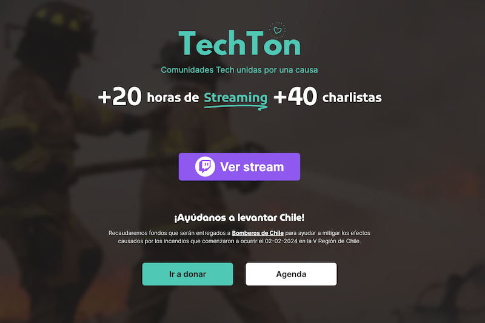
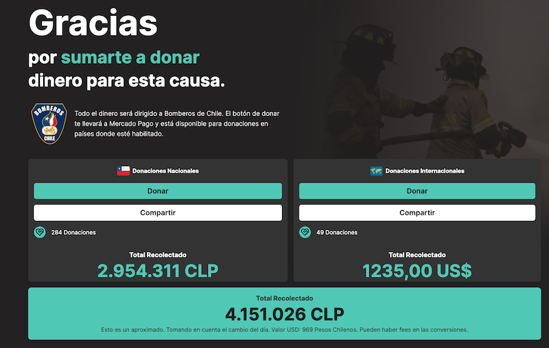
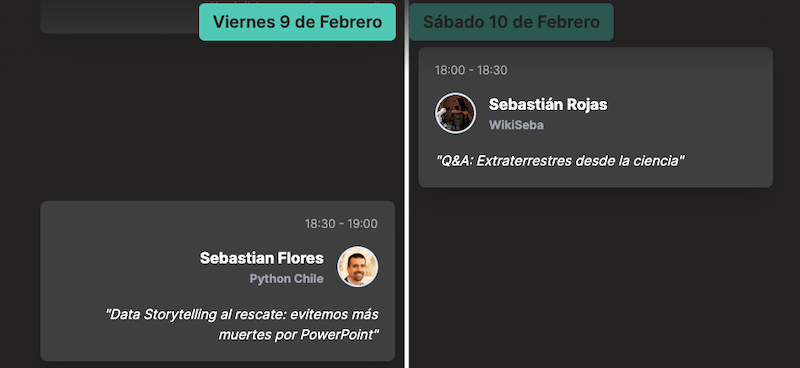

::: {.content-visible when-profile="esp"}
Me invitaron a dar una charla en la Techtón, un evento para recaudar fondos para donar para Bomberos de Chile por los recientes incendios en Viña del Mar.

Fue super potente ver cómo en tiempo récord levantaron una página con un tremendo diseño y super funcional, con los enlaces al twitch y las donaciones, incluso con el conteo de dinero en tiempo real. Colaboraron varias comunidades de ciencia y tecnología unidas, bajo el alero de JavaScript Chile.
En total fueron +20 horas de streaming y +30 charlistas de ciencia y tecnología.

Acá los principales enlaces:

* Website: <https://techton.jschile.org/>
* Día 1: <https://www.twitch.tv/videos/2057806063>
* Día 2: <https://www.twitch.tv/videos/2058631454>
* Twitch de la comunidad Javascript Chile: <twitch.tv/javascriptchile>

¡¡¡Se logró reunir más de 4 millones de pesos!!!

Me alegró mucho que me invitaran a presentar, lo que me dió la oportunidad de hablar de estos temas de Storytelling y Data Storytelling que he estado investigando recientemente. Mi charla fue "Data Storytelling - Evitemos más muertes por PowerPoint". Por razones de tiempo, sólo di 10 consejos para mejorar tu presentación, y no entré en temas de tecnología.

Tuve muy buenas conversaciones durante y post charla, que me ayudarán a hacer mejores presentaciones en el futuro y a refinar lo que he estado preparando como apuntes sobre Data Storytelling. Y además, pude conocer nuevas personas super motivadas y capaces.

:::

::: {.content-visible when-profile="eng"}
I was invited to give a talk at Techtón, an event to raise funds to donate to the Firefighters of Chile due to the recent fires in Viña del Mar.

It was incredibly powerful to see how, in record time, they built a page with a tremendous design and highly functional, with links to Twitch and the donations, even with the real-time money count. Several science and technology communities collaborated together, under the umbrella of JavaScript Chile.
In total there were +20 hours of streaming and +30 science and technology speakers.

Here are the main links:

* Website: <https://techton.jschile.org/>
* Day 1: <https://www.twitch.tv/videos/2057806063>
* Day 2: <https://www.twitch.tv/videos/2058631454>
* Twitch of the JavaScript Chile community: <twitch.tv/javascriptchile>

They managed to raise more than 4 million pesos!!!

I was very glad to be invited to present, which gave me the opportunity to talk about these topics of Storytelling and Data Storytelling that I have been researching recently. My talk was "Data Storytelling - Let's Avoid More Deaths by PowerPoint". Due to time constraints, I only gave 10 tips to improve your presentation, and did not get into technology topics.

I had very good conversations during and after the talk, which will help me give better presentations in the future and refine what I have been preparing as notes on Data Storytelling. And in addition, I got to meet new, highly motivated and capable people.

:::
