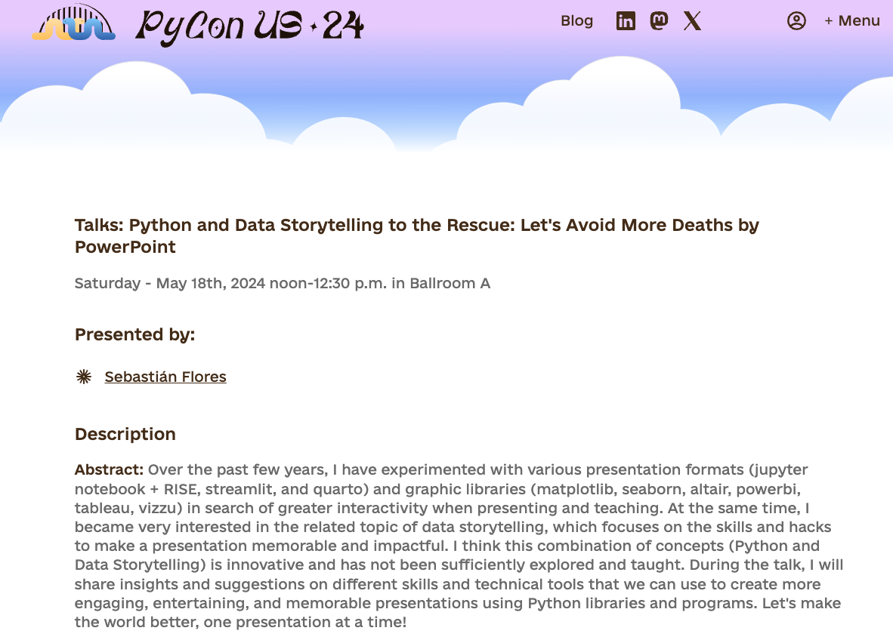

::: {.content-visible when-profile="esp"}
Ya es oficial con mucho orgullo y alegría puedo contar que estaré presentando en la PyCon US
Acá les comparto los enlaces de la [programación](https://us.pycon.org/2024/schedule/) y del [abstract de mi charla](https://us.pycon.org/2024/schedule/presentation/19/)

Tanto mi charla en inglés como en español tuvieron buenas evaluaciones y fueron aceptadas. Decidí presentar en inglés, porque ya he presentado sobre Data Storytelling en español (PyCon Chile 2023, Techton 2024), y porque creo que es un desafío más grande. Estoy muy agradecido de la PSF, porque además me proporcionaron financiamiento para realizar el viaje y la estadía.

El proceso de llegar a presentar en la Pycon US ha sido muy interesante, porque representa un hito importante en una búsqueda que llevo realizando desde hace algun tiempo sin saberlo. Todo partió cuando me atreví a ir a una PyCon por primera vez, y postular una charla, que terminó siendo aceptada. La charla fue "¿Cómo hacer encuestas interactivas en Jupyter + RISE?", en la Pycon Colombia 2020. Luego de esa primera experiencia, participé en varios eventos y comencé a hablar más frecuentemente:

* "Coding as a Service: Librería pypsdier, aprendizajes y metodología", en la PyCon Argentina 2020
* "Presentaciones Interactivas con Jupyter Notebook + RISE. Todo lo que necesitas saber en 30 minutos", en la Pycon Latam 2021
* "WebApps con Streamlit: ¡más fácil que la tabla del uno, poh!", en la PyCon Chile 2021
* "Construí esto, pero... ¿Cómo lo comparto?" para la iniciativa de 1000 programadores Salta (2022)
* "Vizzualización de Datos", en el PyDay Chile 2023

Finalmente, en la PyCon Chile 2023, di mi primera keynote: "¿Cómo hacer Data Storytelling con Python?"

Mirando hacia atrás, todas las charlas comparten la curiosidad sobre cómo compartir tu código con otras personas y cómo hacer tus proyectos y presentaciones más interactivos e interesantes. Creo que esa es una temática que siempre me ha fascinado, y de lo cual sólo recientemente me he dado cuenta. Además, todo esto se entiende y resume bajo el marco de Data Storytelling. Haber encontrado el concepto de Data Storytelling ha sido enriquecedor porque me ha permitido encontrar más fácilmente lecturas e información que conecta con mis intereses, y me permite comentar esta búsqueda con otras personas. Estoy seguro que será un concepto que se usará mucho a futuro. De la misma manera, espero que el viaje a la PyCon US esté lleno de aprendizajes.

Participar de eventos de PyCon me ha entregado muchísimas oportunidades de las cuales estoy muy agradecido. Participar del programa de Streamit Creators, y ser parte de la comunidad de Python Chile son parte fundamental de mis actividades no laborales y me llenan de energía y entusiasmo. Espero que esta charla en la PyCon US pueda ayudar a otras personas a ganar confianza y presentar de mejor manera, para que evitemos más muertes por PowerPoint.
:::

::: {.content-visible when-profile="eng"}
It's now official: with great pride and joy I can share that I will be presenting at PyCon US
Here I share the links to the [schedule](https://us.pycon.org/2024/schedule/) and to the [abstract of my talk](https://us.pycon.org/2024/schedule/presentation/19/)

Both my talk in English and in Spanish received good evaluations and were accepted. I decided to present in English, because I have already presented on Data Storytelling in Spanish (PyCon Chile 2023, Techton 2024), and because I think it is a bigger challenge. I am very grateful to the PSF, because they also provided me with funding to make the trip and the stay.

The process of getting to present at PyCon US has been very interesting, because it represents an important milestone in a search I have been carrying out for some time without knowing it. It all started when I dared to go to a PyCon for the first time, and submit a talk, which ended up being accepted. The talk was "How to make interactive surveys in Jupyter + RISE?", at PyCon Colombia 2020. After that first experience, I participated in several events and began to speak more frequently:

* "Coding as a Service: pypsdier library, learnings and methodology", at PyCon Argentina 2020
* "Interactive Presentations with Jupyter Notebook + RISE. Everything you need to know in 30 minutes", at PyCon Latam 2021
* "WebApps with Streamlit: easier than the times table, dude!", at PyCon Chile 2021
* "I built this, but... How do I share it?" for the 1000 programmers Salta initiative (2022)
* "Data Visualization", at PyDay Chile 2023

Finally, at PyCon Chile 2023, I gave my first keynote: "How to do Data Storytelling with Python?"

Looking back, all the talks share a curiosity about how to share your code with other people and how to make your projects and presentations more interactive and interesting. I think that is a theme that has always fascinated me, and which I have only recently become aware of. In addition, all of this is understood and summarized under the framework of Data Storytelling. Having found the concept of Data Storytelling has been enriching because it has allowed me to more easily find readings and information that connect with my interests, and it lets me discuss this search with other people. I am sure it will be a concept that will be used a lot in the future. In the same way, I hope the trip to PyCon US will be full of learnings.

Participating in PyCon events has given me so many opportunities for which I am very grateful. Participating in the Streamlit Creators program, and being part of the Python Chile community are a fundamental part of my non-work activities and fill me with energy and enthusiasm. I hope this talk at PyCon US can help other people gain confidence and present better, so that we avoid more deaths by PowerPoint.
:::
