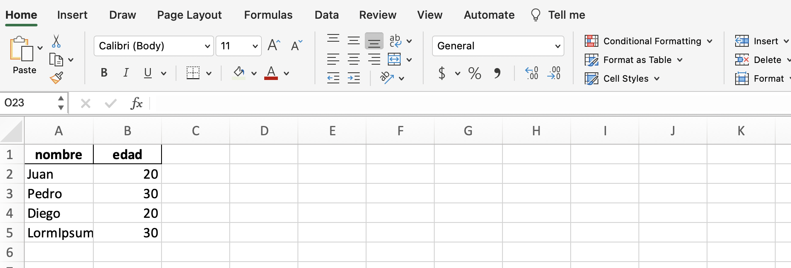
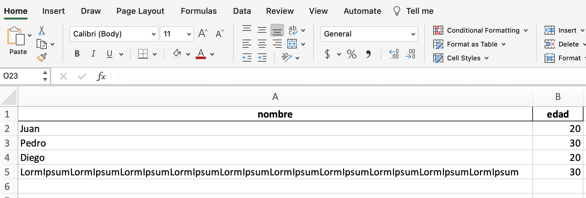

::: {.content-visible when-profile="esp"}
Cuando creas un archivo excel con pandas, el ancho de las columnas queda fijo y eso suele ser molesto cuando tienes que revisar el contenido. Mira el siguiente ejemplo típico:

```{python}
import pandas as pd

# Dummy dataframes
df = pd.DataFrame({"nombre":["Juan", "Pedro", "Diego", "LormIpsum"*10],
                     "edad":[20, 30, 20, 30]})

# Save to excel XLSX file
filename = "ejemplo_sin_autofit.xlsx"
excel_writer = pd.ExcelWriter(filename, engine="xlsxwriter")
# Save the first dataframe
sheet_name = "Personas"
df.to_excel(excel_writer, sheet_name=sheet_name, index=False)
# Close the excel file
excel_writer.close()
```

Mis archivos excel se veían como en la siguiente imagen:



Hoy aprendí una manera super simple de hacer que las columnas generen el ancho de manera dinámica. Sólo requiere usar 'xlrxwriter' y su metodo autofit! No funciona con openpyxl, otra buena librería para manejar excels desde python.

```{python}
import pandas as pd

# Dummy dataframes
df = pd.DataFrame({"nombre":["Juan", "Pedro", "Diego", "LormIpsum"*10],
                     "edad":[20, 30, 20, 30]})

# Save to excel XLSX file
filename = "ejemplo_con_autofit.xlsx"
excel_writer = pd.ExcelWriter(filename, engine="xlsxwriter") # Must be xlsxwriter
# Save the first dataframe
sheet_name = "Personas"
df.to_excel(excel_writer, sheet_name=sheet_name, index=False)
excel_writer.sheets[sheet_name].autofit() # This makes the columns to be autofitted!!!
# Close the excel file
excel_writer.close()
```

¡El truco solo requiere una línea! Basta con acceder a la pestaña desde el ExcelWriter usando su nombre, y aplicar el método autofit.

El excel resultante es el siguiente:



Por supuesto, el truco puede aplicarse a todas las pestañas del archivo.
:::

::: {.content-visible when-profile="eng"}
When you create an excel file with pandas, the column width stays fixed and that's usually annoying when you have to review the content. Look at the following typical example:

```{python}
import pandas as pd

# Dummy dataframes
df = pd.DataFrame({"nombre":["Juan", "Pedro", "Diego", "LormIpsum"*10],
                     "edad":[20, 30, 20, 30]})

# Save to excel XLSX file
filename = "ejemplo_sin_autofit.xlsx"
excel_writer = pd.ExcelWriter(filename, engine="xlsxwriter")
# Save the first dataframe
sheet_name = "Personas"
df.to_excel(excel_writer, sheet_name=sheet_name, index=False)
# Close the excel file
excel_writer.close()
```

My excel files looked like the following image:


Today I learned a super simple way to make columns generate their width dynamically. It only requires using 'xlrxwriter' and its autofit method! It doesn't work with openpyxl, another good library for handling excels from python.

```{python}
import pandas as pd

# Dummy dataframes
df = pd.DataFrame({"nombre":["Juan", "Pedro", "Diego", "LormIpsum"*10],
                     "edad":[20, 30, 20, 30]})

# Save to excel XLSX file
filename = "ejemplo_con_autofit.xlsx"
excel_writer = pd.ExcelWriter(filename, engine="xlsxwriter") # Must be xlsxwriter
# Save the first dataframe
sheet_name = "Personas"
df.to_excel(excel_writer, sheet_name=sheet_name, index=False)
excel_writer.sheets[sheet_name].autofit() # This makes the columns to be autofitted!!!
# Close the excel file
excel_writer.close()
```

The trick only requires one line! Just access the sheet from the ExcelWriter using its name, and apply the autofit method.

The resulting excel is the following:


Of course, the trick can be applied to all the sheets of the file.
:::
