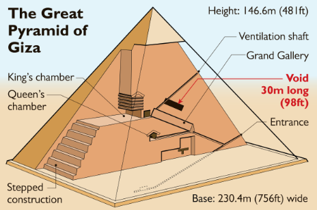

::: {.content-visible when-profile="esp"}
Una de las premisas del Data Storytelling es partir por el final. Eso significa definir de manera precisa el final que quieres en tu presentación, y asegurar que está alineado con tus objetivos y tu audiencia. Sólo cuando has definido el final de manera crítica y segura, puedes ir construyendo hacia atrás las slides que son estrictamente necesarias para sostener ese final.

Esta aproximación suele ser contraintuitiva, y tendemos a no aplicarla. Puede incluso descabellado, como construir una pirámide desde el vértice superior hacia abajo. Sin embargo, es la aproximación más razonable para el diseño. Si partimos diseñando desde la base de la pirámide al tuntún, nunca sabremos que altura tendrá la pirámide. Si sabemos a que altura **queremos** que esté el vértice de la pirámide, podemos calcular todas las otras dimensiones y construir la pirámide adecuada.

Al enfrentar una semana de trabajo o un nuevo proyecto también podemos utilizar esta filosofía. ¿Qué es lo que queremos que ocurra al final de la semana o proyecto? ¿Podemos imaginar con detalle el final? Desde ahí, podemos pensar cuales son las tareas y actividades que tenemos que realizar para llegar a ese final preciso.

Tener definido el final deseado ayuda muchísimo porque permite priorizar y definir el criterio de éxito. Ayuda a definir tus objetivos, y ser conciente de cómo obtenerlos, en lugar de dar tumbos y llenarse de actividades que no contribuyen al final deseado.
:::

::: {.content-visible when-profile="eng"}
One of the premises of Data Storytelling is to start with the end. That means precisely defining the ending you want for your presentation, and making sure it is aligned with your objectives and your audience. Only once you have defined the ending in a critical and confident way can you build backwards the slides that are strictly necessary to support that ending.

This approach is often counterintuitive, and we tend not to apply it. It may even seem absurd, like building a pyramid from the top vertex downward. However, it is the most reasonable approach for design. If we start designing from the base of the pyramid haphazardly, we will never know how tall the pyramid will be. If we know how high we **want** the vertex of the pyramid to be, we can calculate all the other dimensions and build the right pyramid.

When facing a workweek or a new project, we can also use this philosophy. What is it that we want to happen at the end of the week or project? Can we imagine the ending in detail? From there, we can think about what tasks and activities we need to carry out to reach that precise ending.

Having the desired ending defined helps a lot because it allows you to prioritize and define the criterion of success. It helps you define your objectives, and be aware of how to achieve them, instead of stumbling around and filling up with activities that do not contribute to the desired ending.
:::
