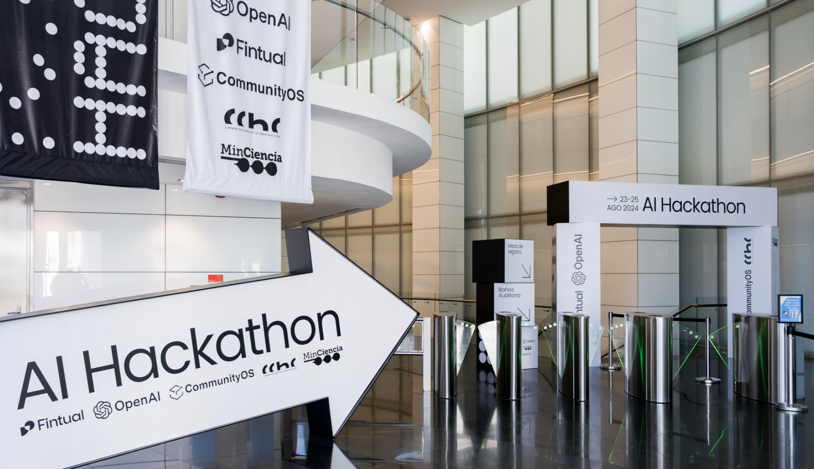

::: {.content-visible when-profile="esp"}
El sábado 24 de agosto viajé temprano a Santiago a participar como mentor en la Hackatón de OpenAI 2024 en Chile. Me emocionaba mucho que me hubieran dado esa oportunidad, pues era un evento bastante exclusivo (sólo se podía participar por invitación) y que me interesaba muchísimo. No puedo sino agradecer esa oportunidad que se abrió por participar de Python Chile.

A las 9 am estaba ingresando al edificio de la Cámara Chilena de la Construcción - un imponente edificio. Todo el evento ocurrió en el subterráneo: al bajar las escaleras mecánicas estaba el mesón de acreditación, y cerca de ahí, el comedor y baños. Avanzando por el pasillo, la sala de coordinación, la gran sala de la hackathon (que era como 5 salas pequeñas unidas), y el auditorio del evento donde ocurrieron las charlas.

Había participado en otra hackathon antes, pero no en rol de mentor, por lo que al principio estaba medio perdido sobre cual era mi rol. A las 10:00 reunieron a los mentores y nos comentaron sobre cual sería la dinámica, responsabilidades y consejos. Cada uno podía aportar con sus conocimientos específicos, pero lo más importante era aclarar dudas logísticas y asegurarse que los equipos mantuvieran el foco y pudieran presentar una buena demo al día siguiente. Durante la mañana y tarde estuve paseando entre los distintos grupos, revisando avances y haciendo sugerencias. Fue entretenido saludar a varias personas que conocía sólo de interacciones virtuales, y hacer muchos nuevos conocidos. Los otros mentores eran todos muy bacanes en lo que hacían. ¡Conocí muchísima gente!

Creo que la mayor lección que me llevo del evento es la siguiente: ya nadie sabe todo. Los conocimientos de cada uno son distintos, y no alcanzan para hacer un buen producto. Nos necesitamos los unos a los otros. Necesitamos colaborar para poder hacer cosas distintas y de impacto.

Como dice el dicho:
**viaja solo si quieres ir rápido. Viaja acompañado si quieres llegar lejos.**

")

")

")

")
:::

::: {.content-visible when-profile="eng"}
On Saturday, August 24, I traveled early to Santiago to take part as a mentor in the OpenAI Hackathon 2024 in Chile. I was very excited that I had been given this opportunity, since it was a rather exclusive event (you could only participate by invitation) and one I was very interested in. I can only be grateful for that opportunity that opened up through being part of Python Chile.

At 9 am I was entering the building of the Cámara Chilena de la Construcción - an imposing building. The whole event took place in the basement: going down the escalators there was the accreditation desk, and near it, the dining area and restrooms. Going down the hallway, the coordination room, the large hackathon room (which was like 5 small rooms joined together), and the event auditorium where the talks took place.

I had taken part in another hackathon before, but not as a mentor, so at first I was a bit lost about what my role was. At 10:00 they gathered the mentors and told us what the dynamics, responsibilities, and tips would be. Each of us could contribute with our specific knowledge, but the most important thing was to clear up logistical doubts and make sure the teams stayed focused and could present a good demo the next day. During the morning and afternoon I wandered among the different groups, reviewing progress and making suggestions. It was fun to greet several people I had only known through virtual interactions, and to make many new acquaintances. The other mentors were all really awesome at what they did. I met so many people!

I think the biggest lesson I take from the event is the following: nobody knows everything anymore. Everyone's knowledge is different, and it is not enough to build a good product. We need one another. We need to collaborate in order to make different and impactful things.

As the saying goes:
**travel alone if you want to go fast. Travel together if you want to go far.**

")

")

")

")
:::
