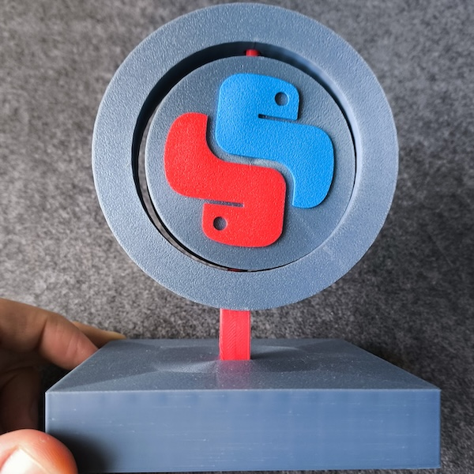
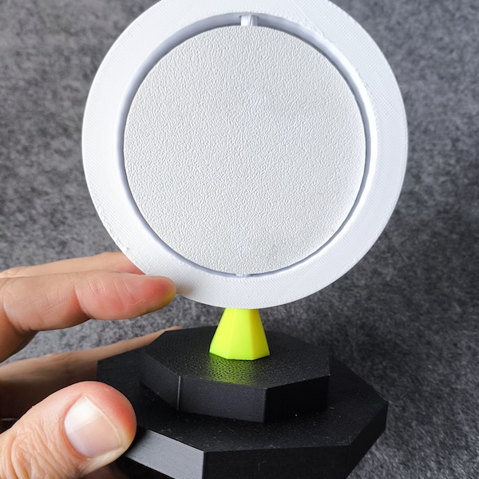
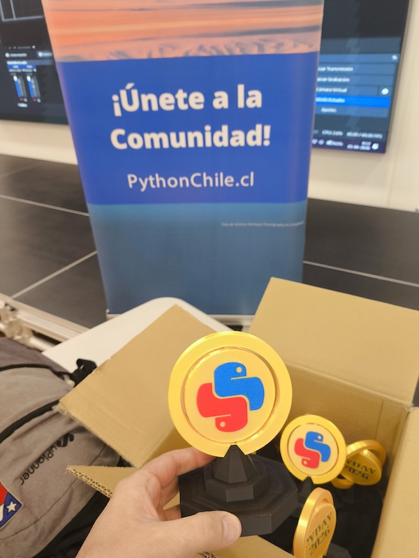

::: {.content-visible when-profile="esp"}
En Octubre del año pasado (2025) compré una impresora 3d: una bambu lab A1 con AMS (multi filamento). Había pensado que los usuarios más adeptos seríamos mi hijo y yo, pero Cote me sorprendió encontrando usos inesperados (regalos personalizados, adornos de navidad y halloween, diseños para pintar con lapices acrílicos, entre otros). Imprimimos muchas cosas desde el marketplace (ya creados por otros), pero tenía ganas de hacer algo yo mismo desde cero usando tinkercad.

El [PyDay 2026](http://pyday.cl) me dió la escusa perfecta: me ofrecí a hacer los galvanos de recuerdos para los charlistas. 

Quería que el galvano incluyera el logo de Python Chile y que tuviera un elemento giratorio. Esto terminó siendo más dificil de lo que pensaba, pero me permitió aprender muchísimo.

## Prueba #1 - la prueba de concepto
La prueba de concepto me permitió entender muchas cosas.  

Partí generando los conectores de la pieza giratoria por separado, pero era engorroso insertarla y las piezas quedaban muy sueltas. Además, el ancho de las piezas era muy grande (2 cms) lo que l hacía ver muy tosca.

**Aprendizajes**: Es más fácil diseñar un único modelo para imprimir, y lograr que ciertas uniones se rompan para permitir el giro.

## Prueba #2 - estilizando
La parte superior se imprime en una única pieza, que tiene soportes que se rompen elegantemente permitiendo la rotación libre.
Al reducir el ancho de las piezas se logra que el galvano se vea más estilizado, pero también se ve frágil. La unión de la base y la placa giratoria se ve muy débil.

No me gustaron las terminaciones de las superficies. Las superficies “rotadas” en la base me generan cierta disonancia.
Aprendí: A diseñar soportes integrados al modelo (en lugar de hacer que se generen automáticamente).

## Prueba #3 - final
La unión entre la base y la placa giratoria me seguía pareciendo débil, así que agregué una pieza adicional que permitiera una unión de encaje que diera mayor estabilidad. Imprimí los galvanos con filamentos negro y "oro".


:::

::: {.content-visible when-profile="eng"}
Last October (2025) I bought a 3D printer: a Bambu Lab A1 with AMS (multi-filament). I had figured that my son and I would be the most enthusiastic users, but Cote surprised me by finding unexpected uses (personalized gifts, Christmas and Halloween decorations, designs to paint with acrylic pencils, among others). We printed lots of things from the marketplace (already created by others), but I wanted to make something myself from scratch using Tinkercad.

[PyDay 2026](http://pyday.cl) gave me the perfect excuse: I offered to make the commemorative trophies for the speakers.

I wanted the trophy to include the Python Chile logo and to have a rotating element. This ended up being harder than I thought, but it let me learn a ton.

## Attempt #1 - the proof of concept
The proof of concept helped me understand a lot of things.

I started by making the connectors for the rotating piece separately, but it was cumbersome to insert and the pieces fit very loosely. Also, the pieces were too wide (2 cm), which made it look very clunky.

**Lessons learned**: It's easier to design a single model to print, and to make certain joints break to allow rotation.

## Attempt #2 - styling
The top part is printed as a single piece, which has supports that break elegantly to allow free rotation.
By reducing the width of the pieces, the trophy looks more stylized, but it also looks fragile. The joint between the base and the rotating plate looks very weak.

I didn't like the surface finishes. The "rotated" surfaces on the base create a certain dissonance for me.
What I learned: To design supports integrated into the model (instead of having them generated automatically).

## Attempt #3 - final
The joint between the base and the rotating plate still seemed weak to me, so I added an extra piece that allowed a snap-fit joint to provide greater stability. I printed the trophies with black and "gold" filaments.


:::
